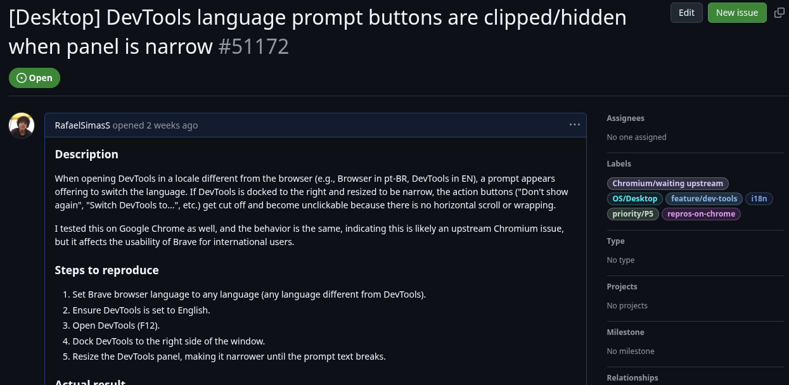
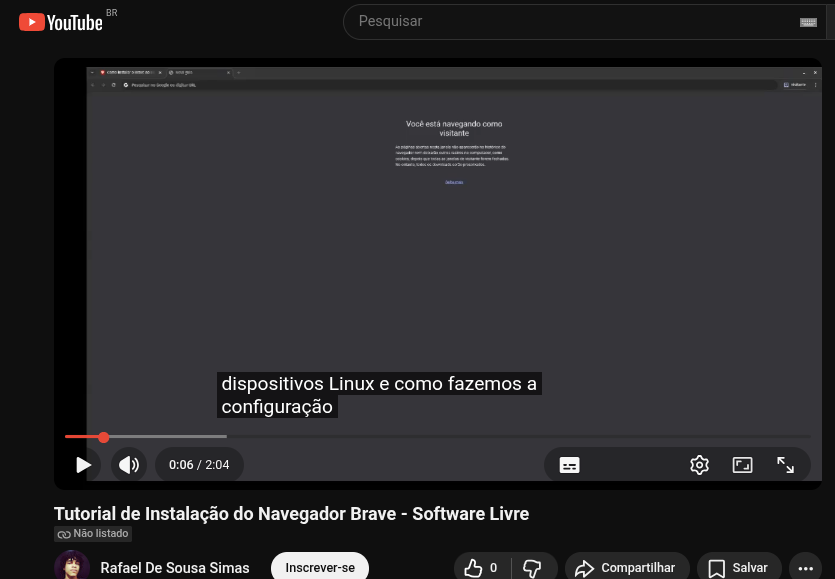

# Relatório do Trabalho Final - Navegador Brave

- **Alunos:** Rafael de Sousa Simas, Jorge Lucas, Edilson Marques
- **Nível:** Graduação

## Reportar Bug

- Botões de prompt de idioma nas ferramentas de desenvolvedor ficam fora da tela em telas pequenas ([Brave#51172](https://github.com/brave/brave-browser/issues/51172)).

## Adicionar pequena funcionalidade

- Ferramenta de Texto para Voz em português ([Brave Voice Brasil](https://github.com/jorgelucasp42/brave-voice-brasil)).

## Produção de Conteúdo Audiovisual ou Série de Posts

- Vídeo Tutorial de Como Instalar o navegador em dispositivos Linux e configurar Bloqueador de anúncios. ([Vídeo](https://youtu.be/x1dNnURlIgY))

