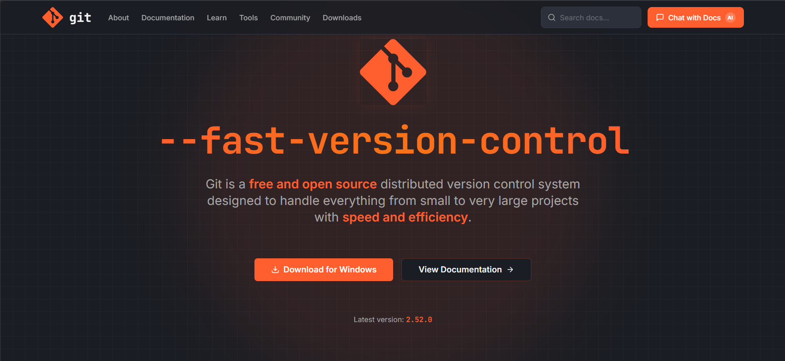
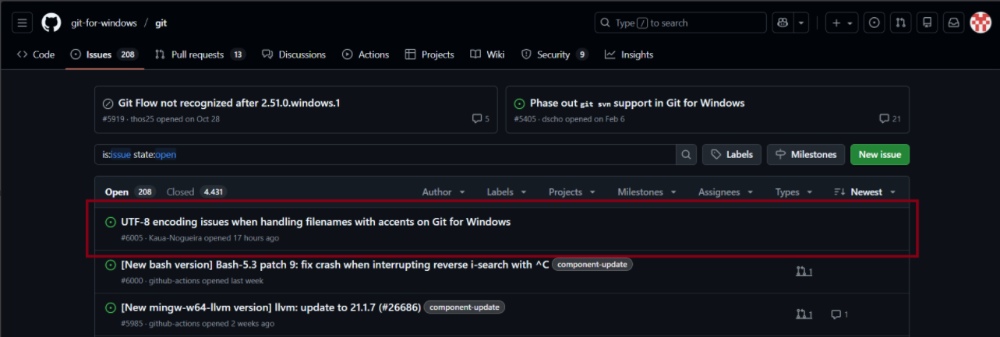

# Relatório de Contribuições – Etapa 2

## Projeto
GIT

## Integrantes
Benjamin
Gabriel Vinícius
Kauã Nogueira
Reinaldo de Jesus

---

### 1. Nova UI/UX no site e Melhorar Documentação 
- Redesign completo do site de documentação
- Nova organização visual e navegação
- https://git-restyle.vercel.app/
- Evidências: 
- 

---

### 2. Chat com IA integrado
- Inserção de chat com IA no site
- IA responde com base na documentação
- Evidências: 
- 
- https://github.com/gabrielsilveira2004/git_rag/

---

### 3. Bug Report no Git 
- Reporte de bug real de encoding UTF-8 no Git for Windows
- https://github.com/git-for-windows/git/issues/6005
- Evidências: 

---
